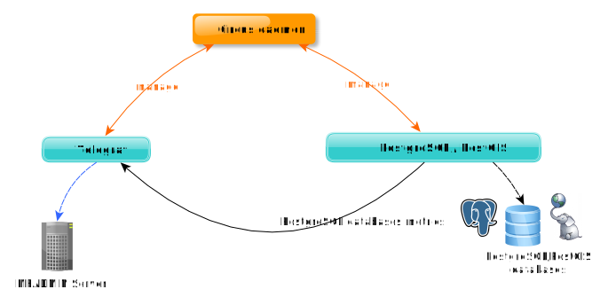

# Introduction to MFBASE

.. index:: PostgreSQL, PostGIS
## What is mfbase?

MFBASE is the storage module of the Metwork framework. It allows you to easily and quickly install a database.

Currently, Metwork supplies only [PostgreSQL](http://postgresql.org/) / [PostGIS](http://postgis.refractions.net/). You could check the current :index:`PostgreSQL/PostGIS version` :ref:`here <mfext:layer_scientific_core:packages>`

In the near future, some other :index:`database engine` will be available in Metwork.

If you make your first steps with MFBASE, we prompt you to check the :doc:`mfbase_quick_start` section to discover the MFBASE features.

## Why would I use mfbase?

If you need a 'ready to use' database engine, MFBASE is the module you need.

When you create a PostgreSQL database from MFBASE, the most popular PostgreSQL and PostGIS extensions are installed and available.

## How it works?

[Circus](https://circus.readthedocs.io/en/latest/) is a Python program in order to monitor and control processes and sockets.

[Telegraf](https://docs.influxdata.com/telegraf/) is a plugin-driven server agent for collecting and sending metrics and events from databases, systems, and IoT sensors.

`mflog2mfadmin` (based on [jsonlog2elasticsearch](https://github.com/metwork-framework/jsonlog2elasticsearch)) on is a daemon to send [mflog](https://github.com/metwork-framework/mflog) to elasticsearch.

Circus acts as a process watcher and runner. You may check the full `circus.ini` configuration file in the `/home/mfbase/tmp/config_auto/` directory. Check the [Circus architecture](https://circus.readthedocs.io/en/latest/design/architecture/)

:index:`Monitoring` and :index:`Dashboards` are available through :doc:`MFADMIN <mfadmin:mfadmin_monitoring_plugins>`.

.. seealso::
    | :doc:`MFADMIN Documentation <mfadmin:index>`
    | :doc:`mfadmin:mfadmin_monitoring_plugins`.
    
<!--
Intentional comment to prevent m2r from generating bad rst statements when the file ends with a block .. xxx ::
-->