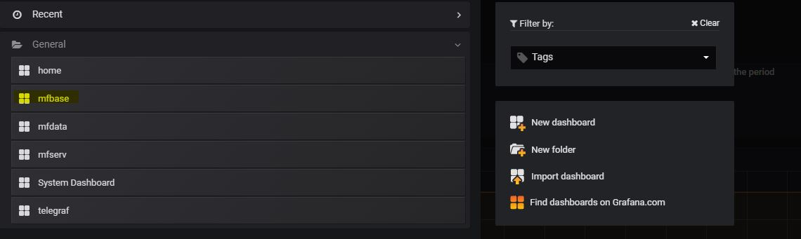
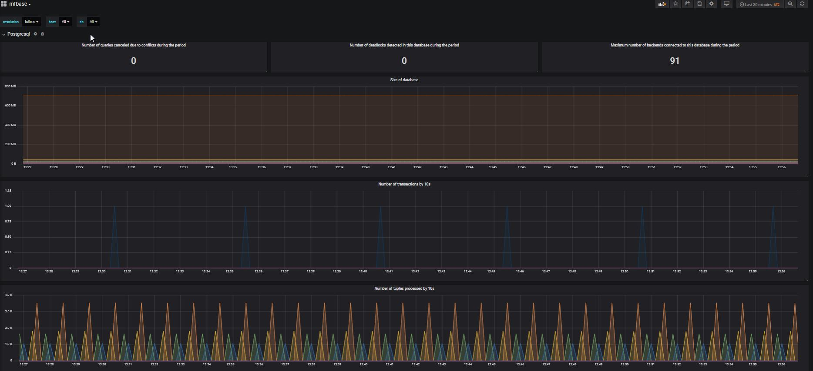

# Monitoring and Dashboard

.. seealso::
    :doc:`MFADMIN documentation <mfadmin:index>`


### Monitor PostgreSQL
Through Metwork MFADMIN module, you may monitoring PostgreSQL. 

In order to do this, you have to:

- install Metwork MFADMIN and MFSYSMON modules
- in the `[admin]` section of the `config/config.ini` in the root directory of MFBASE, set the `hostname` parameter value with the host name or IP address where MFADMIN is running:

```cfg
[admin]
# null => no monitoring
# hostname=null
# By setting hostname = localhost, we assume MFADMIN is running on the same Linux machine, 
# if MFADMIN is running on a different machine, set hostname = {your_host_name} or { your_host_ip_address}
hostname=localhost
# influxdb_http_port=18086
```

Then restart MFBASE Metwork service:
```bash
service metwork restart mfbase
```

### Dashboards
Dashboards are available from MFADMIN Grafana GUI Interface which is displayed through HTTP on `http://{your_mfadmin_host}:15602` (default login is `admin/admin`), e.g. http://localhost:15602.


Then, click `mfbase` to open MFBASE dashboards.



MFBASE dashboards are displayed. Check MFADMIN documentation for more details.



You may want to implement your own dashboard with specific metrics. In order to do this, you may refer to MFADMIN documentation and the :ref:`mfdata:mfdata_additional_tutorials:Create a specific dashboard with our metrics`.

### Useful links and Tips

MFADMIN relies on the following components:

- [Grafana](http://docs.grafana.org/): Data visualization & Monitoring.
- [InfluxDB](https://docs.influxdata.com/influxdb/): Time series database
- [Telegraf](https://docs.influxdata.com/telegraf/): Collecting & reporting metrics

_ _ _

.. tip::
	If you do not see any metrics in your Grafana dashboard, check the `telegraf.log` file in the `log` directory of the root MFDATA directory.

    If you see `[agent] Error writing to output [influxdb]: could not write any address` and/or `net/http: request canceled (Client.Timeout exceeded while awaiting headers)`, you are probably behind a proxy, and this could happen when MFADMIN and MFDATA are not runinng on the same machine.

    You should try to fix this issue by setting the `HTTP_PROXY`, `HTTPS_PROXY` and/or `NO_PROXY` in the `/etc/default/telegraf` file or other proxy configuration file, e.g. `NO_PROXY="*"`
_ _ _

.. tip::
	You may query the InfluxDB database from the InfluxDB’s command line interface `influx` located in `/opt/metwork-mfadmin-master/opt/monitoring/bin/influx`.

    Check **Tools 'InfluxDB command line interface (CLI/shell)'** menu from the `InfluxDB documentation <https://docs.influxdata.com/influxdb/>`_.

    The MFADMIN database name is `metrics`. The default port is `18086`.

Example :
```bash
/opt/metwork-mfadmin-master/opt/metrics/bin/influx -database 'metrics' -host 'localhost' -port '18086'
```
```sql
Connected to http://localhost:18086 version 1.7.2
InfluxDB shell version: 1.7.2
Enter an InfluxQL query
> select * from postgresql
```

.. seealso::
    `Influx Query Language (InfluxQL) reference <https://docs.influxdata.com/influxdb/v1.7/query_language/>`_

.. important::
	When you upgrade MFADMIN Metwork package, the dashboards are overwritten, so that you may lose the custom dashboards you designed.

    So, it's highly recommended to **export** the dashboards you want to keep, and the **import** the dashboards once the Metwork upgrade is done.

    In order to export/import dashboard, check `Grafana documentation <http://docs.grafana.org/reference/export_import/>`_.

.. important::
	When you upgrade MFADMIN Metwork package, the InfluxDB database that contains metrics is overwritten.

    So, it's recommended to **backup** the InfluxDB database, and the **restore** it once the Metwork upgrade is done.

    In order to backup/restore InfluxDB database, check **Administration 'Backing up and restoring'** menu from the `InfluxDB documentation <https://docs.influxdata.com/influxdb/>`_.

<!--
Intentional comment to prevent m2r from generating bad rst statements when the file ends with a block .. xxx ::
-->
