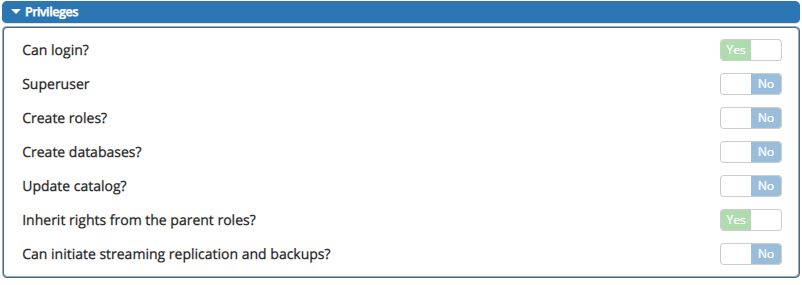

# Quickstart

**This quickstart will teach you how to create, release and install:**
- **a MFBASE PostgreSQL storage plugin, i.e create a :index:`PostgreSQL` database (with :index:`PostGIS` extension available).**
- **a MFBASE WebDAV storage plugin, i.e manage a :index:`WebDAV` repository (through :index:`Nginx`).**

## Prerequisites

The MFBASE module must be installed. See :doc:`installation instructions<install_a_metwork_package>`.

Once `mfbase` is installed:

- The command `ls /opt |grep mfbase` must return something.
- A `mfbase` user and, therefore, a `/home/mfbase` directory are created.


.. hint::
	Once MFBASE is installed, a `metwork` PostgreSQL :index:`administrative account` is created with default password `metwork`. You can change it in the `[postgresql]` section of the `/home/mfbase/config/config.ini` file. The created database user has the following privileges:


## Activate MFBASE environment by logging in as mfbase user.

Once MFDATA is installed, a `mfdata` user and, therefore, a `/home/mfbase` directory are created.

Log in as the mfbase user:
```bash
su - mfbase
```

.. note::
	If it's the first time you log in as mfbase user, there is no default password. You have to either set a password before (`passwd mfbase` or `sudo passwd mfbase`) or use `su - mfbase` from `root` to log in as `mfbase` user.


When you are logged in as `mfbase` user, you must see a MetWork welcome screen on your terminal like:

```console
           __  __      ___          __        _
          |  \/  |    | \ \        / /       | |
          | \  / | ___| |\ \  /\  / /__  _ __| | __
          | |\/| |/ _ \ __\ \/  \/ / _ \| '__| |/ /
          | |  | |  __/ |_ \  /\  / (_) | |  |   <
          |_|  |_|\___|\__| \/  \/ \___/|_|  |_|\_\


Welcome on xxxx (xxxxx.meteo.fr, 192.168.1.170)
(module: MFBASE, version: integration.14.3d17536)

 14:28:51 up 18 days,  2:49,  1 user,  load average: 0.16, 0.21, 0.23


```

Then you are able to create your first plugin.

.. index:: PostgreSQL
## Creating your first plugin with PostgreSQL Database support

We are going to create a `foo` plugin, and then create the corresponding database named `plugin_foo`.

### Create the PostgreSQL plugin

First, list the available templates, the following command:
```bash
bootstrap_plugin.py list
```

Currently, there is only one `default` template :
```console
List of available plugin templates:
     * default
```

To create the plugin, run the following command:
```bash
bootstrap_plugin.py create foo
```

Once you have entered this command, you will be asked to fill in some fields to configure and customize your plugin: for now, press `[ENTER]` to set the most of the default value, except for **Select use_storage:**, you may enter 2 (no), because we don't need WebDAV support here.
You will be able to modify your plugin configuration anytime later.

The `/home/mfbase` directory now contains a `foo` sub-directory with files:

> **config.ini** : configuration file of the plugin  
**Makefile** : directives to build the plugin   
**crontab** `crontab` file to schedule the execution of programs, empty by default. For further details, refer to :ref:`mfbase_crontab_support` section  
**sql/foo.sql** : SQL queries to run during plugin installation (empty for the moment)    

Let'assume we want to create an `account` table on installation. To do this, edit the `sql/foo.sql` script and add you slq instruction to create the table:
```sql
-- SQL queries to run during plugin installation
CREATE TABLE account(
     user_id serial PRIMARY KEY,
     username VARCHAR (50) UNIQUE NOT NULL,
     password VARCHAR (50) NOT NULL,
     email VARCHAR (355) UNIQUE NOT NULL,
     created_on TIMESTAMP NOT NULL,
     last_login TIMESTAMP
);

```

Right now, the database is not yet created. You have to [release your plugin](#releasing-the-plugin) then [install your plugin](#installing-the-plugin) in order to create you database.

### Releasing the PostgreSQL plugin

We will now release the `foo` plugin. Releasing a the plugin makes it ready to be deployed/installed.

To do this, go to the `foo` plugin directory and enter the command:
```bash
make release
```

This will create a `.plugin` file that will be used to deploy/install the plugin, e.g. `foo-[version]-1.metwork.mfbase.plugin` where `[version]` is the value of the `version` parameter of the foo `config.ini` you enter when you create the plugin (default value is `${MFMODULE_VERSION}`). You may change it:
```cfg
# Version of the plugin (X.Y.Z)
# If the value is [MFMODULE_VERSION],
# the current module version is used
version=1.0.0
```

.. hint::
	| You do not have to create your database schema (tables, views, stored procedures,...) by setting the sql/{plugin-name}.sql. You can leave this file empty and create your schema afterwards.
    | If you create the schema after the plugin installation, pay attention to the user from which you create the schema. If it's not the user `plugin_{plugin_name}`, you will probably have to grant privileges to this user `plugin_{plugin_name}` on the created objects.

### Installing the PostgreSQL plugin

By installing the plugin, we will create the database on PostgreSQL database server of the current machine, i.e. the machine from which we run the plugin installation.

In order to install the database, enter the command plugins.install {path_to_your_.plugin_file}, e.g.:
```bash
plugins.install foo-1.0.0-1.metwork.mfbase.plugin
```

This will create:

- a `plugin_foo` postgresql database
- a `plugin_foo` postgresql username (with full rights on `plugin_foo` database)
- a default password: `plugin_foo` for `plugin_foo` username


The created database user has the following privileges:


.. note::
	The database name consists of the following : `plugin_{your_plugin_name}`. Same for the database username/userpassord.

.. important::
	If the plugin is already installed, you have to `uninstall the PostgreSQL plugin <#uninstalling-the-postgresql-plugin>`_.

Then, check the `foo` plugin is installed, enter:

```bash
plugins.list
```

```
| NAME                      | VERSION                   | RELEASE
---------------------------------------------------------------------------
| foo                       | 1.0.0                     | 1

```

### Testing your database

As the default port for the `mfbase` postgresql server is `7432`, you can connect
to your newly created database with this command:

```bash
psql -U plugin_foo -h localhost -p 7432 plugin_foo
# (use plugin_foo as password when prompted)
```

or by configuring your favorite `postgresql` client to:

```
hostname: your_mfbase_host
username: plugin_foo
password: plugin_foo
port: 7432
database: plugin_foo
```

Then check the `account` table is created. Connect to PostgreSQL server, the database `plugin_foo`. Then, issue the command `\d account` to find the information on columns of the `account` table:
```psql
Password for user plugin_foo:
psql (10.1)
Type "help" for help.

plugin_foo=> \d account
```
```
                                           Table "public.account"
   Column   |            Type             | Collation | Nullable |                 Default
------------+-----------------------------+-----------+----------+------------------------------------------
 user_id    | integer                     |           | not null | nextval('account_user_id_seq'::regclass)
 username   | character varying(50)       |           | not null |
 password   | character varying(50)       |           | not null |
 email      | character varying(355)      |           | not null |
 created_on | timestamp without time zone |           | not null |
 last_login | timestamp without time zone |           |          |
Indexes:
    "account_pkey" PRIMARY KEY, btree (user_id)
    "account_email_key" UNIQUE CONSTRAINT, btree (email)
    "account_username_key" UNIQUE CONSTRAINT, btree (username)

```
### Uninstalling the PostgreSQL plugin

You may want to uninstall the plugin, for instance, in order to install it again or install a newer version of the plugin.

.. caution::
	Uninstalling a MFBASE plugin causes the deletion of the database without any confiramtion. So, before uninstalling the plugin, maybe you should do a backup of the database, to avoid losing your database data.

In order to uninstall (destroy) the database, enter the command `plugins.uninstall {your_plugin_name}`, e.g.:
```bash
plugins.uninstall foo
```

.. index:: WebDAV
## Creating your first plugin with WebDAV support

We are going to create a `foo_webdav` plugin.

### Create the WebDAV plugin

First, list the available templates, the following command:
```bash
bootstrap_plugin.py list
```

Currently, there is only one `default` template :
```console
List of available plugin templates:
     * default
```

To create the plugin, run the following command:
```bash
bootstrap_plugin.py create foo_webdav
```

Once you have entered this command, you will be asked to fill in some fields to configure and customize your plugin: for now, press `[ENTER]` to set the most of the default value, except for **Select use_postgresql:**, you may enter 2 (no), because we don't need PostgreSQL support here.
You will be able to modify your plugin configuration anytime later.

The `/home/mfbase` directory now contains a `foo_webdav` sub-directory with files:

> **config.ini** : configuration file of the plugin  
**Makefile** : directives to build the plugin   
**crontab** `crontab` file to schedule the execution of programs, empty by default. For further details, refer to :ref:`mfbase_crontab_support` section  
**initial_storage/foo.txt** : just a sample file available through http storage.    


Let's now **install (as dev build)** the plugin by entering the command (from the `foo_webdav` plugin directory):
```bash
make develop
```

Then, check the `foo_webdav` plugin is installed, enter:

```bash
plugins.list
```

```
| NAME                      | VERSION                   | RELEASE
---------------------------------------------------------------------------
| foo_webdav                | dev_link                  | dev_link

```

### Testing the WebDAV plugin

First, **we will do a GET request**, with [cUrl](https://curl.haxx.se/), on the storage service for the `foo_text` file created in the `initial_storage`. 
The url to request is : `http://<your_hostname_or_ip>:<mfbase_nginx_port>/storage/<your_plugin_name>/<your_file>`, e.g.:
```bash
curl http://localhost:18942/storage/foo_webdav/foo.txt
```
The response is the content of the `foo.txt` file:
```
just a file available through http storage
```

.. note::
    The requested file is not the file stored in the `initial_storage` directory. 
    When you run `make develop` or when you install the plugin with the `plugins.install [...].plugin`  (`.plugin` file built with `make release`),
    the content of the `initial_storage` is copying into the `./var/storage/foo_webdav` MFBASE home directory.
    
    **Be careful** when you run the `make develop` command or when you (re)install the plugin because the `./var/storage/foo_webdav` 
    will be **erased and replaced** by the content of the `initial_storage` directory.
 
.. important:: 
    | If you are behind a proxy, you have to set `http_proxy` and `https_proxy` environment variables in order to be able to download any Python package you may need.
    | You may also disable the proxy with the [--noproxy](https://curl.haxx.se/docs/manual.html) options of the cUrl command.
    | You may also need to disable your Linux firewall:
    |   `systemctl status firewalld`
    |   `systemctl stop firewalld.service`
    |   `systemctl disable firewalld`
       
_ _ _ 

Now, we will **upload a new file** (binary file) to our WebDAV repository with a **PUT request**.
The url to request is : `http://<your_hostname_or_ip>:<mfbase_nginx_port>/storage/<your_plugin_name>/[<subdir>]/<your_file>`, e.g.:
```bash
curl -XPUT --data-binary @/tmp/test.grib2 http://localhost:18942/storage/foo_webdav/grib/grib4D/test_grib.grib2
```
.. important:: 
     By default, the maximum size (in MB) for one storage item is 100 Mo
     If you need too upload larger files, change the  :doc:`Nginx configuration upload_max_body_size parameter <mfbase_nginx_conf>` value if the MFBASE configuration file.
       
.. tip:: 
    | In the cUrl command above, the `@path_to_filename`  mean you want to send the contents of the `path_to_filename` file.
       

You can check, from your browser, the **directory listing** of your uploaded files with the following url: 
`http://<your_hostname_or_ip>:<mfbase_nginx_port>/storage/<your_plugin_name/[<subdir>]/`, e.g. `http://localhost:18942/storage/foo_webdav/grib/grib4D/`
This is made possible thanks to the :doc:`Nginx configuration storage_autoindex parameter <mfbase_nginx_conf>` set to 1.
If you want to disable this behaviour, set :doc:`storage_autoindex=0 <mfbase_nginx_conf>` in the MFBASE configuration file (and restart MFBASE service).

You can also check the uploaded file is the same  as the roginal one. Download the uploaded file above and compare the original file and the downloaded one.
There is no difference, e.g.:
```bash
curl -o /tmp/test_grib_downloaded.grib2 http://localhost:18942/storage/foo_webdav/grib/grib4D/test_grib.grib2
diff /tmp/test_grib_downloaded.grib2 /tmp/test.grib2
```

Let's now delete recursively uploaded directory (e.g. `grib`), e.g.:
```bash
curl -XDELETE  http://localhost:18942/storage/foo_webdav/grib/
```

.. warning::
    At this time, even if each plugin is namespaced, there is no security between plugins (**you can delete the files of another plugin**) 
    and there is no security from the outside world (**you can do DELETE request from anywhere**). 
    
    However, you can **restrict** globally, in :doc:`Nginx configuration <mfbase_nginx_conf>`, the allowed DAV methods (`storage_dav_methods`), the min. delete depth (`storage_min_delete_depth`), the autoindex feature (`storage_autoindex`).
    You can also disable Nginx if you don’t need it (`flag=0`).

<!--
Intentional comment to prevent m2r from generating bad rst statements when the file ends with a block .. xxx ::
-->
